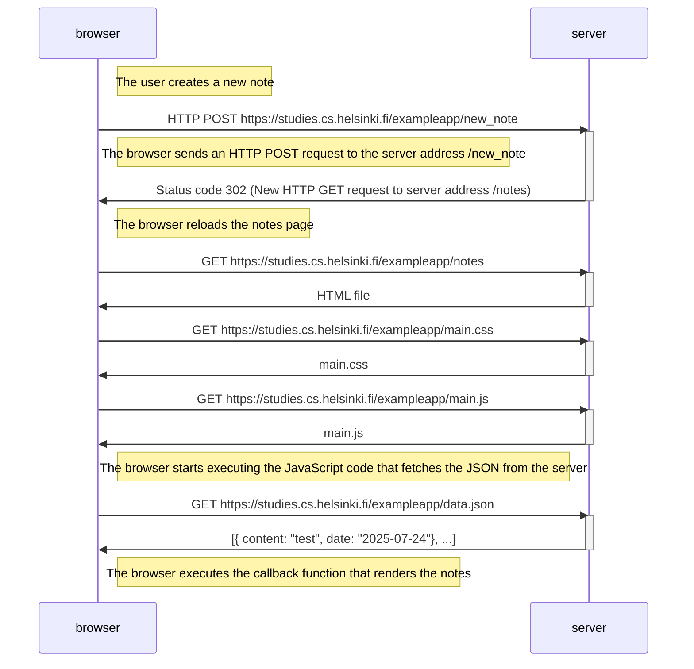

```mermaid
sequenceDiagram
    participant browser
    participant server

Note right of browser: The user creates a new note

browser->>server: HTTP POST https://studies.cs.helsinki.fi/exampleapp/new_note
activate server
Note right of browser: The browser sends an HTTP POST request to the server address /new_note
server->>browser: Status code 302 (New HTTP GET request to server address /notes)
deactivate server

Note right of browser:  The browser reloads the notes page

browser->>server: GET https://studies.cs.helsinki.fi/exampleapp/notes
activate server
server->>browser: HTML file
deactivate server

browser->>server: GET https://studies.cs.helsinki.fi/exampleapp/main.css
activate server
server->>browser: main.css
deactivate server

browser->>server: GET https://studies.cs.helsinki.fi/exampleapp/main.js
activate server
server->>browser: main.js
deactivate server

Note right of browser: The browser starts executing the JavaScript code that fetches the JSON from the server

browser->>server: GET https://studies.cs.helsinki.fi/exampleapp/data.json
activate server
server->>browser: [{ content: "test", date: "2025-07-24"}, ...]
deactivate server

Note right of browser: The browser executes the callback function that renders the notes
```
