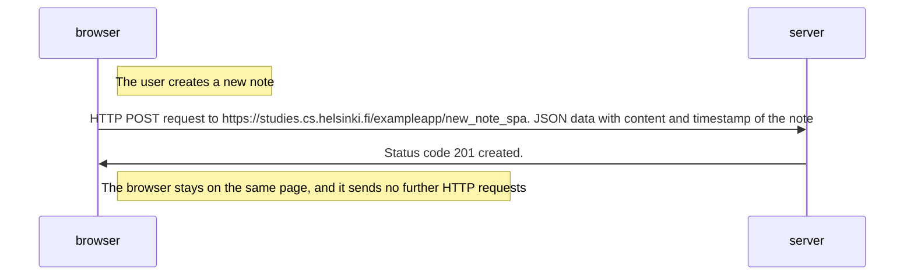

```mermaid
sequenceDiagram
    participant browser
    participant server

Note right of browser: The user creates a new note

browser->>server: HTTP POST request to https://studies.cs.helsinki.fi/exampleapp/new_note_spa. JSON data with content and timestamp of the note
server->>browser: Status code 201 created.

Note right of browser: The browser stays on the same page, and it sends no further HTTP requests
```
